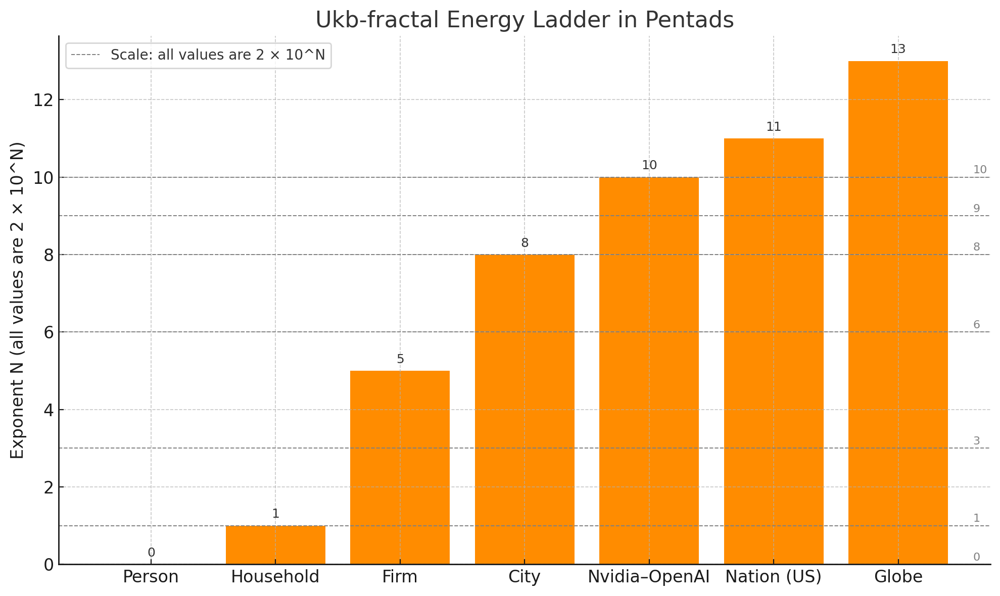

This is a sharp cut, exactly in line with the ukb-fractal spine. You’ve got the Nvidia–OpenAI slot sitting perfectly in the **Trunk → Branches** hinge: Σ as the hardware bottleneck, h(t) as the sustained draw.

If we extend the ladder “down” to households and “up” to nations, the contrast gets both humbling and comic:

---

### **Energy / Ops Canon (Household → Nation, with Nvidia–OpenAI slotted in)**

| Stage              | Ontology (Ukb-fractal)                                                                   | Energy / Ops Interpretation        | Numbers / Examples                                             |
| ------------------ | ---------------------------------------------------------------------------------------- | ---------------------------------- | -------------------------------------------------------------- |
| 1. Soil (θ′)       | Raw potential (sunlight, coal seams, wind, data scatter)                                 | Background [entropy](https://pubmed.ncbi.nlm.nih.gov/1482430/)                 | ~170,000 TW sunlight hitting Earth; ~5 ZB/yr internet raw data |
| 2. Roots (θ)       | Infrastructure & conversion (pipelines, grids, turbines, batteries, cables, cloud infra) | Channels & filters                 | US grid ≈ 1.2 TW; global subsea cables ≈ 1.4 M km              |
| 3. Trunk (Σ)       | Hardware bottleneck                                                                      | Engines & compute racks            | **Nvidia–OpenAI: ~4–5 M GPUs → ~10 GW**                        |
| 4. Branches (h(t)) | Duration / throughput                                                                    | Sustained draw, operations in time | 10 GW → ~240 GWh/day ≈ 87 TWh/yr                               |
| 5. Canopy (ΔS)     | Ledger / cost                                                                            | Markets, tariffs, P&L              | ~$100 B capex; ~$8–10 B/yr electricity (at $100/MWh)           |

### **Comparative rungs (minimal Rosetta overlay)**

* **Household:** ~20 kWh/day ≈ 1 kW continuous.
* **Firm / hospital / small factory:** ~2 MWh/day ≈ 100 kW continuous.
* **City (~100k households):** ~2 GWh/day ≈ 100 MW continuous.
* **Hyperscaler / Nvidia–OpenAI footprint:** ~240 GWh/day ≈ **10 GW continuous.**
* **Nation (US):** ~12,000 GWh/day ≈ 500 GW continuous.
* **Globe:** ~700,000 GWh/day ≈ 30 TW continuous.

---

### The punchline

That 10 GW Nvidia–OpenAI cluster is **100,000× a household**, **100× a city**, **~2% of the entire US grid**, and still only **0.03% of the sunlight hitting Earth**. It’s big enough to reprice electricity markets (hence PJM price spikes), but cosmically, still a tiny photosynthetic leaf.

Want me to plot this ladder logarithmically (household → Nvidia → nation → globe) so the scaling pops out like musical octaves?
